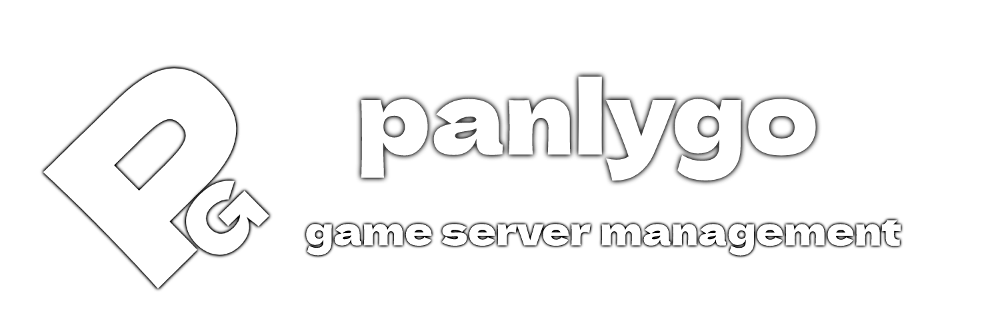
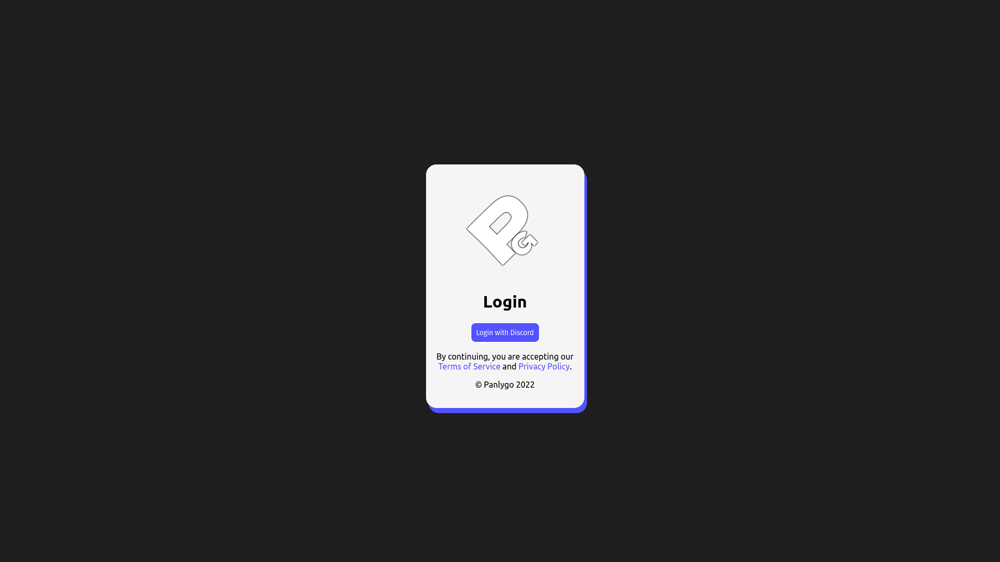

# Panlygo

> NOTICE: This project is still under development and not usable yet. We will make it open-source when its ready.

Panlygo, an open-source game server management panel built with ReactJS and Go.

Screenshots

 

 
Join our Discord for sneak peeks and updates 😁

---

# Todo
- ✅ = Done
- 🛠 = Doing
- ❓ = Not planned yet

| List      | Status |
| ----------- | ----------- |
| Auth      | ✅       |
| Dashboard   | ✅        |
| Store Page   | 🛠        |
| Admin Panel   | 🛠        |
| Server Creation   | 🛠        |
| Docker Support   | ❓        |

# Supported OS
> NOTICE: Panlygo will work on any OS as long as the dependencies work.

| Operating System      | Support |
| ----------- | ----------- |
| Ubuntu 18.04 / later      | ✅       |

> Panlygo 2023, by @rhylso.
